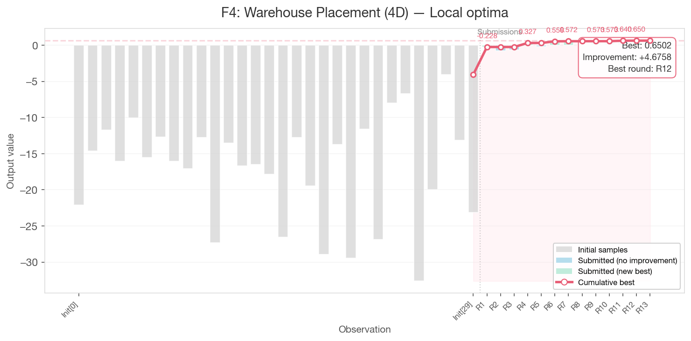
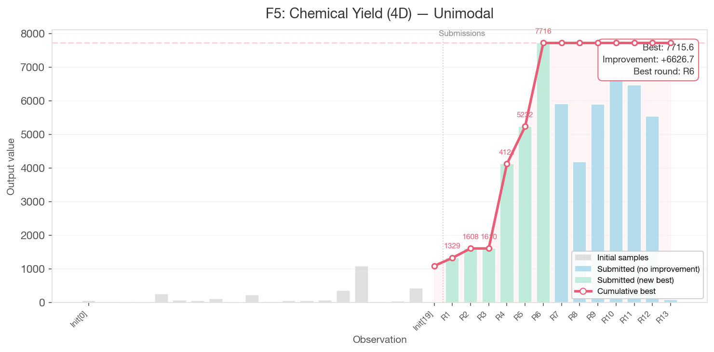
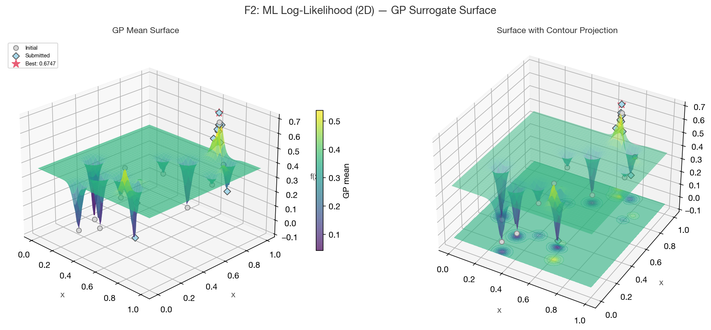

# Model Card: Gaussian Process for Bayesian Optimisation

## Model Description

**Input:** D-dimensional vectors in [0, 0.999999] representing function parameters (2D for F1/F2, up to 8D for F8)

**Output:** Predicted function value (GP mean) and uncertainty estimate (GP standard deviation) at any query point. These are used by the Expected Improvement acquisition function to propose the next evaluation point.

**Model Architecture:** Gaussian Process Regression (scikit-learn `GaussianProcessRegressor`) with composite kernel:

```
ConstantKernel(1.0, (0.1, 10.0)) * Matern(length_scale=0.5, nu=2.5) + WhiteKernel(noise_level=1e-5, noise_level_bounds=(1e-8, 1e-1))
```

- **Matern(nu=2.5):** Models smooth but non-trivial functions; assumes twice differentiability
- **ConstantKernel:** Learned amplitude scaling
- **WhiteKernel:** Learned observation noise level
- **n_restarts_optimizer=5:** Multiple restarts for kernel hyperparameter fitting
- **normalize_y=True:** Output normalisation for numerical stability

## Performance

All 8 functions improved over their initial best values across 13 rounds of Bayesian Optimisation:

| Function | Dim | Best Value | Best Round | Improvement over Initial |
|----------|-----|-----------|------------|--------------------------|
| F1       | 2D  | 8.58e-16  | Round 7    | +0.87e-16 (trivial)      |
| F2       | 2D  | 0.6747    | Round 6    | +0.064                   |
| F3       | 3D  | -0.0071   | Round 8    | +0.028                   |
| F4       | 4D  | 0.6502    | Round 12   | +4.676                   |
| F5       | 4D  | 7715.6    | Round 6    | +6626.7                  |
| F6       | 5D  | -0.0153   | Round 13   | +0.699                   |
| F7       | 6D  | 1.6920    | Round 7    | +0.327                   |
| F8       | 8D  | 9.9711    | Round 7    | +0.373                   |

**Convergence plots** showing per-function progress across all observations (initial samples + 13 submitted rounds):


*F4 (Warehouse Placement) — the most consistent improver, climbing from -4.03 to +0.65 across 12 rounds.*


*F5 (Chemical Yield) — largest absolute gain (+6627), but the R6 peak of 7716 was never replicated.*

**GP surrogate surfaces** for the 2D functions reveal the model's learned landscape:


*F2 shows a genuinely multimodal landscape with competing peaks visible in the GP surface.*

All convergence plots and GP surfaces are available in `results/per_function/` and reproducible via `notebooks/04_visualisations.ipynb`.

### Where the model worked well

- **F4** (4D): Most consistent improver. Climbed steadily from -4.03 to +0.65 across 12 rounds. The GP surrogate accurately guided exploitation in a landscape with gradual gradients.
- **F5** (4D): Largest absolute gain (+6627). The GP identified the gradient toward high values on dims 2-4 (near 1.0).
- **F7/F8** (6D/8D): Both peaked during the Round 7 exploration round, demonstrating that deliberate broad search can unlock regions missed by exploitation.

### Where the model struggled

- **F1** (2D): The radiation source function has a sub-0.001-wide peak. The GP modelled it as a flat surface near zero, producing EI=0 everywhere. The surrogate was fundamentally unable to represent the extreme spikiness.
- **F2** (2D): Noisy, multimodal function. The GP gave different predictions at nearly identical points (0.675 vs 0.470 at the same region), indicating the noise model was insufficient.
- **F5 in later rounds**: Output values spanning 92 to 7716 violate the GP's homoscedastic noise assumption. The R6 best of 7716 was never replicated despite 7 subsequent attempts at nearby points.

## Limitations

- **Single kernel for all functions:** Matern(nu=2.5) was used uniformly. F1 needed a rougher kernel (nu=0.5) for its spiky peak; F5 needed output transformations for its heteroscedastic range.
- **Homoscedastic noise assumption:** WhiteKernel assumes constant noise variance across the input space. Functions like F2 (noisy) and F5 (extreme range) violate this.
- **Random candidate search:** EI was maximised by evaluating random candidates rather than gradient-based optimisation. This is inefficient in higher dimensions (F7, F8) and may miss narrow EI peaks.
- **GP overconfidence:** For F1, the GP assigned near-zero uncertainty everywhere, collapsing EI to zero. This prevented any meaningful acquisition-guided search.
- **No output transformations:** Log or power transforms (as used in HEBO) could have helped with F5's extreme output range.
- **Scalability:** GP complexity is O(n^3) in observations. Not an issue at our scale (max 53 points) but would not scale to thousands.

## Trade-offs

| Trade-off | Choice Made | Consequence |
|-----------|------------|-------------|
| **Single kernel vs per-function kernels** | Single Matern(nu=2.5) for all functions | Simpler, fewer hyperparameters to manage, but poor fit for F1 (too smooth for spike) and F5 (constant noise assumption violated). |
| **Random candidate search vs gradient-based EI optimisation** | Random candidates (100k-300k) | Simpler implementation, no gradient computation needed, but less sample-efficient. For F7 (6D) and F8 (8D), many candidates needed to cover the space. |
| **Exploration vs exploitation scheduling** | Phased: explore early, exploit late, with one deliberate exploration reset in R7 | Front-loaded exploration built GP model quality. R7 exploration reset produced 4 new bests. But late-stage exploitation for F5 failed catastrophically (92 vs 7716), suggesting more exploration was needed. |
| **Per-function strategy vs uniform approach** | Per-function from R4 onward | More complex to manage (8 strategy configurations per round), but produced significantly better results. The uniform approach in R1-3 hit diminishing returns by R3. |
| **Manual strategy tuning vs automated** | Manual adjustment based on round-by-round analysis | Allowed nuanced, context-aware decisions (e.g., F4's drifting optimum) but relied on human judgement. Automated kappa scheduling (as used by peers with UCB) would have been more consistent. |

## Ethical Considerations

No ethical concerns. All functions are synthetic with no real-world impact. No personal data is used.

## What We Would Do Differently

Based on 13 rounds of evidence:

1. **Per-function kernels**: Matern(nu=0.5) for F1 (spiky), wider noise bounds for F2 (noisy), RBF for F5 (smooth, unimodal)
2. **Output transformations**: Power or log transforms for F5 to handle 3-order-of-magnitude output range (as recommended by HEBO)
3. **L-BFGS-B multi-start EI optimisation**: Replace random candidate search with gradient-based optimisation of the acquisition function
4. **Max-uncertainty fallback**: When EI=0 (F1), switch to querying the point of maximum GP uncertainty rather than abandoning the function
5. **Adaptive trust regions**: Use TuRBO-style trust regions that expand/contract based on success, rather than manually tuning radius per round
