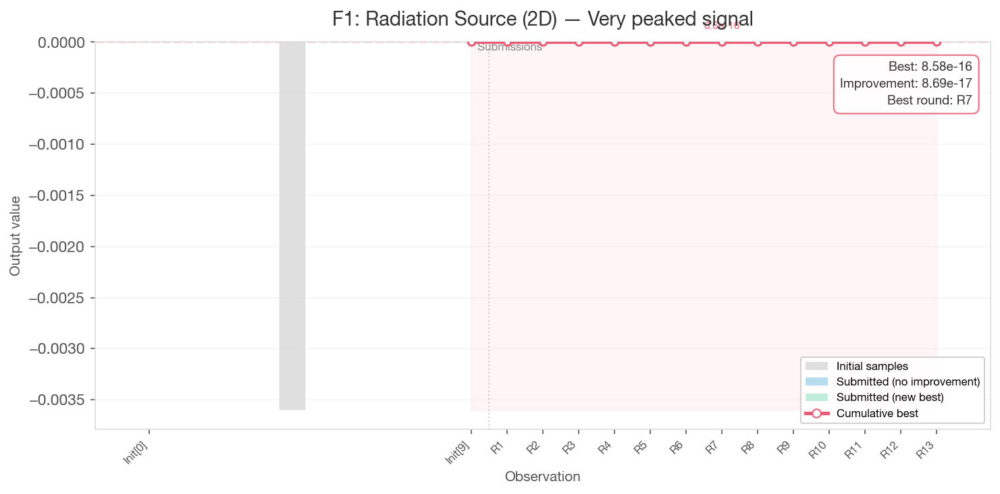
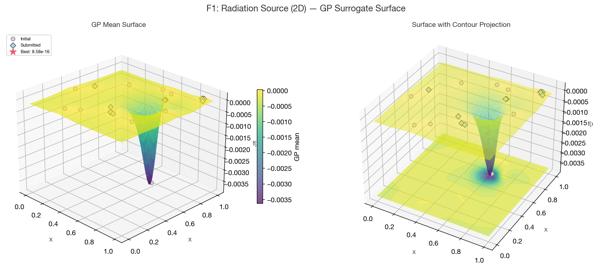
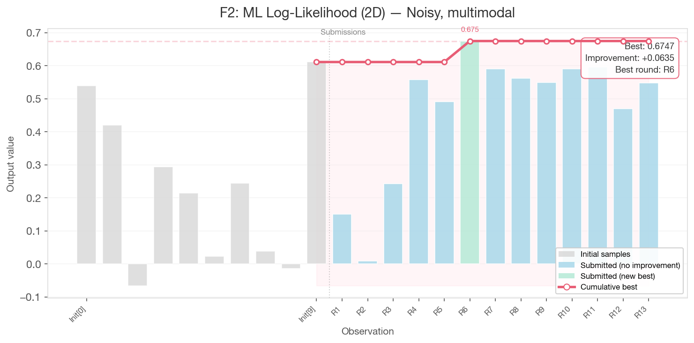
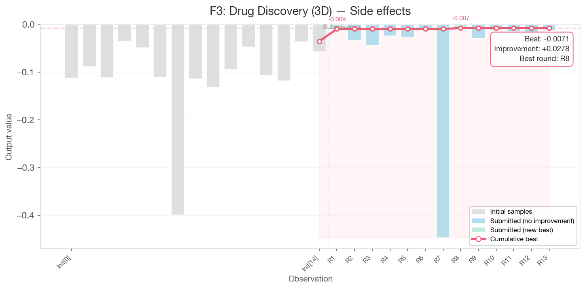
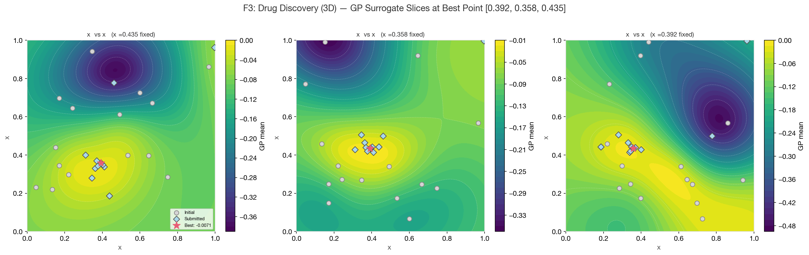
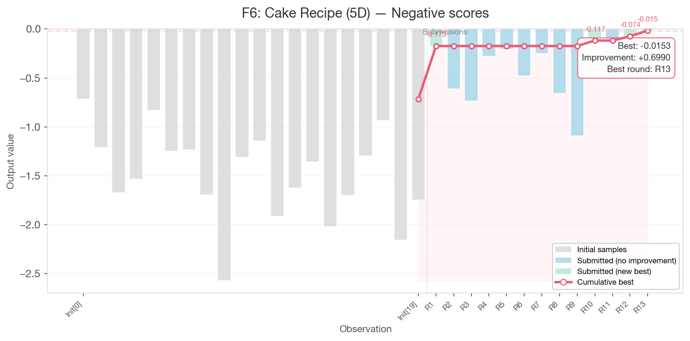
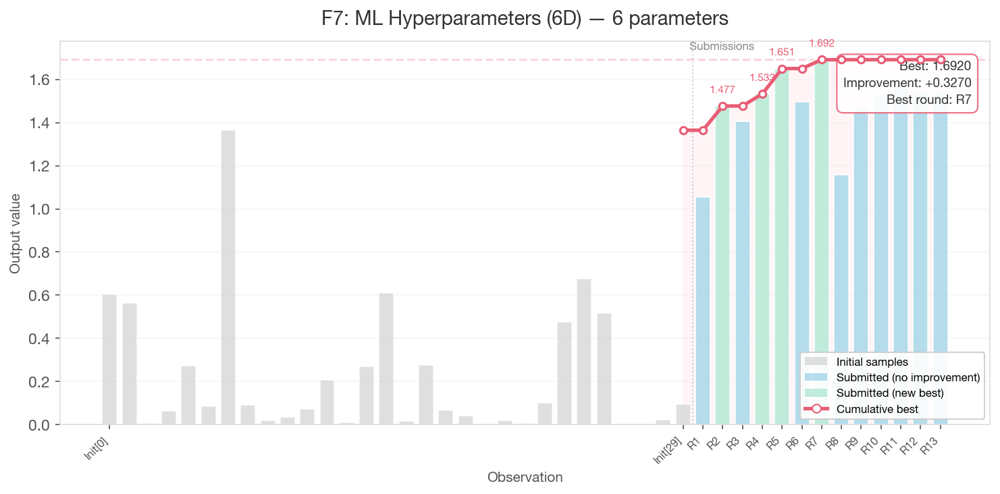
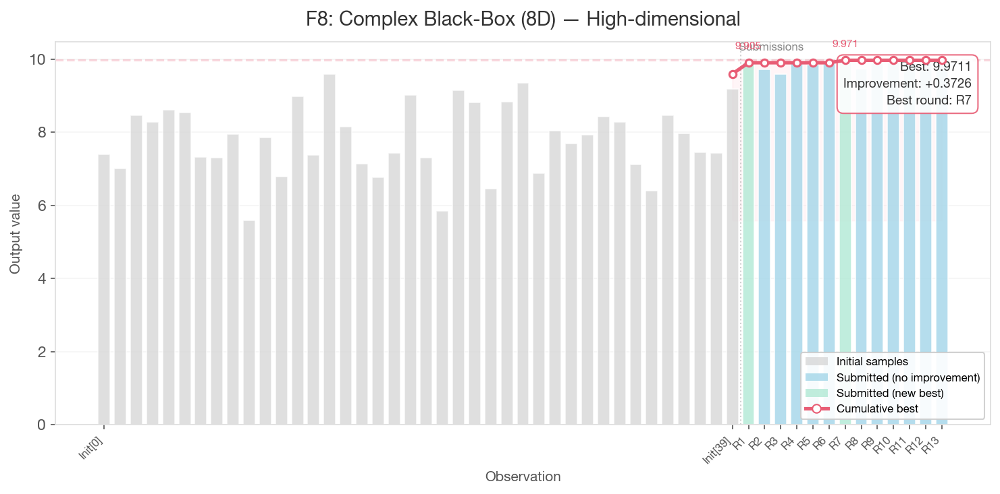

# Per-Function Analysis

## Results Summary

All 8 functions improved over their initial best values across 13 rounds of Bayesian optimisation.

| Function | Dim | Description              | Initial Best | Final Best  | Best Round | Improvement |
|----------|-----|--------------------------|-------------|-------------|------------|-------------|
| F1       | 2D  | Radiation source         | 7.71e-16    | 8.58e-16    | Round 7    | +0.87e-16   |
| F2       | 2D  | ML log-likelihood        | 0.6112      | 0.6747      | Round 6    | +0.0635     |
| F3       | 3D  | Drug discovery           | -0.0348     | -0.0071     | Round 8    | +0.0278     |
| F4       | 4D  | Warehouse placement      | -4.0255     | 0.6502      | Round 12   | +4.6758     |
| F5       | 4D  | Chemical yield           | 1088.9      | 7715.6      | Round 6    | +6626.7     |
| F6       | 5D  | Cake recipe              | -0.7143     | -0.0153     | Round 13   | +0.6990     |
| F7       | 6D  | ML hyperparameters       | 1.3650      | 1.6920      | Round 7    | +0.3270     |
| F8       | 8D  | Complex black-box        | 9.5985      | 9.9711      | Round 7    | +0.3726     |

---

## F1: Radiation Source (2D) — Very peaked signal

**Best value:** 8.58e-16 (Round 7)
**Best point:** [0.923, 0.954]
**Improvement:** +0.87e-16 over initial (trivial)

F1 was the hardest function in the project. The radiation source has an extremely narrow peak — essentially a Dirac delta — where the output is non-zero only within a sub-0.001 window. All 23 observations (10 initial + 13 submitted) returned values indistinguishable from zero. The GP surrogate fitted a flat surface near zero everywhere, producing EI=0 across the entire domain from Round 4 onward.

Two peaks were identified: the initial best at [0.731, 0.733] (7.71e-16) and a second peak at [0.923, 0.954] (8.58e-16) found during the Round 7 exploration rebalance. Despite ultra-tight local search (radius as small as 0.001) and a deliberate maximin exploration to the largest unexplored region at [0.15, 0.55], no meaningful improvement was achieved. The function is simply too peaked for GP-based BO with this sample budget.

**GP Surrogate Surface:**

The 3D surface reveals a single deep trough where the GP is confident about negative values, with the rest of the domain essentially flat at zero. The true positive peak at 8.58e-16 is invisible at this scale — the function's signal is overwhelmed by the noise floor of the GP model.

---

## F2: ML Log-Likelihood (2D) — Noisy, multimodal

**Best value:** 0.6747 (Round 6)
**Best point:** [0.699, 0.926]
**Improvement:** +0.0635 over initial

F2 is a noisy, multimodal function that proved difficult to optimise reliably. The initial best of 0.611 at [0.703, 0.927] was not beaten until Round 6, when a tight local search at [0.699, 0.926] achieved 0.675. However, subsequent rounds querying nearly the same region produced wildly different outputs (0.470 to 0.596), confirming significant observation noise.

The GP surrogate captures the general landscape — a high-value ridge near (0.7, 0.9) — but cannot reliably distinguish the global maximum from nearby local optima due to noise. The WhiteKernel noise bounds (1e-8 to 0.1) may have been too restrictive for this function's actual noise level.

**GP Surrogate Surface:**

The 3D surface shows multiple peaks and valleys — a genuinely multimodal landscape. The GP identifies the high-value ridge in the upper-right region where the best point was found, but several competing local optima are visible across the domain. The contour projection on the bottom shows these multiple modes clearly.

---

## F3: Drug Discovery (3D) — Side effects

**Best value:** -0.0071 (Round 8)
**Best point:** [0.392, 0.358, 0.435]
**Improvement:** +0.0278 over initial

F3 found its first improvement in Round 1 (-0.009) and didn't beat it until Round 8 (-0.007), a gap of 7 rounds. The function's outputs are all negative, with the optimum near zero — suggesting the objective is to minimise adverse side effects (where 0 represents no side effects). The narrow improvement margin (-0.035 to -0.007) indicates the function has a relatively flat near-optimal region.

Exploitation near the R1 best point worked intermittently: R8's tight search at [0.392, 0.358, 0.435] broke through, but subsequent rounds at even tighter radii could not match it. Broad exploration in R7 was catastrophic (-0.447), confirming the function is locally sensitive.

**GP Surrogate Slices:**

The three 2D slices through the best point reveal the GP's model of the 3D landscape. Each slice fixes one dimension at the best value and varies the other two. The x₁ vs x₂ slice (left) shows the near-optimal region as a yellow patch around (0.35-0.45, 0.30-0.40), with deep troughs in the corners. The x₁ vs x₃ and x₂ vs x₃ slices confirm the optimum is in a relatively localised region.

---

## F4: Warehouse Placement (4D) — Local optima

**Best value:** 0.6502 (Round 12)
**Best point:** [0.360, 0.402, 0.427, 0.418]
**Improvement:** +4.6758 over initial

F4 was the project's biggest success story. Starting from an initial best of -4.03, the function climbed steadily across 13 rounds to reach +0.65 — a total improvement of +4.68. The convergence plot shows a textbook BO staircase: each new best (green bar) raises the red cumulative-best line, with the function going positive for the first time in Round 4.

The optimum region shifted over time — dimension 1 drifted from 0.395 (R4) to 0.360 (R12), suggesting the GP was progressively resolving a ridge in the 4D landscape. F4 responded well to tight exploitation (radius 0.01-0.015) in Phase 3, improving in Rounds 9, 10, 11, and 12.

---

## F5: Chemical Yield (4D) — Unimodal

**Best value:** 7715.6 (Round 6)
**Best point:** [0.989, 0.949, 0.965, 0.929]
**Improvement:** +6626.7 over initial

F5 achieved the largest absolute improvement of any function, growing from 1089 to 7716 across 6 rounds. The convergence plot shows a dramatic exponential ramp through Round 6, with dimensions 2-4 pushing toward 1.0 and dimension 1 ascending from 0.335 to 0.989. However, the R6 peak was never replicated — subsequent rounds oscillated between 4180 and 6704, and the final round catastrophically regressed to 92.

This pattern suggests extreme sensitivity: the function landscape near the optimum is very steep, and even small coordinate deviations produce dramatically different outputs. The GP with a stationary Matern kernel cannot capture this heteroscedastic behaviour — output variance clearly changes across the input space (values range from 92 to 7716 in the same region).

---

## F6: Cake Recipe (5D) — Negative scores

**Best value:** -0.0153 (Round 13)
**Best point:** [0.432, 0.413, 0.599, 0.774, 0.091]
**Improvement:** +0.6990 over initial

F6 was the project's latest bloomer. After finding its first improvement in Round 1 (-0.173), the function remained stuck for 9 consecutive rounds despite both exploitation and exploration attempts. The breakthrough came in Round 10 (-0.117), followed by steady improvement through the final submission: R12 (-0.074) and R13 (-0.015).

The convergence plot shows this dramatically: a flat red line for most of the project, then a sharp uptick in the final three bars. The late-stage success suggests the GP needed many observations before it could reliably model the 5D landscape, and that the optimum is near zero (minimising a penalty or cost function).

---

## F7: ML Hyperparameters (6D) — 6 parameters

**Best value:** 1.6920 (Round 7)
**Best point:** [0.000, 0.229, 0.232, 0.205, 0.271, 0.893]
**Improvement:** +0.3270 over initial

F7 was a consistent improver, setting new bests in Rounds 2, 4, 5, and 7. The convergence plot shows a steady ascending staircase with four green bars. The best value of 1.692 was found during the Round 7 exploration rebalance — confirming that a deliberate exploration reset can unlock regions that pure exploitation misses.

Post-R7 exploitation could not match this peak despite 6 rounds of progressively tighter search (radius from 0.05 down to 0.008). The function slowly recovered from a regression low of 1.159 (R8) back to 1.580 (R11), suggesting the GP surrogate was gradually improving but couldn't quite reach the R7 level through local search alone.

---

## F8: Complex Black-Box (8D) — High-dimensional

**Best value:** 9.9711 (Round 7)
**Best point:** [0.157, 0.041, 0.081, 0.036, 0.556, 0.283, 0.151, 0.558]
**Improvement:** +0.3726 over initial

F8 is the highest-dimensional function (8D) and presents the greatest challenge for GP-based BO due to the curse of dimensionality. Despite 40 initial samples — the most of any function — the search space is vast. The convergence plot shows the initial samples varying widely (5.5 to 9.6), with submissions clustering tightly near 9.9.

The best value was found in Round 7's exploration round, suggesting that the dense initial sampling had already covered most of the exploitable landscape. Post-R7 rounds consistently produced values between 9.73 and 9.91 — close but unable to crack 9.97. With 300,000 candidates in the tightest exploitation rounds, F8 may be near the limit of what random candidate sampling can achieve in 8 dimensions.

---

## Key Insights

1. **Exploration rebalance was critical.** Round 7, the dedicated exploration round, produced 4 new bests (F1, F4, F7, F8) — the most productive single round of the project. Pure exploitation from Rounds 8-13 never matched R7's breakthroughs for F7 and F8.

2. **Per-function strategy outperformed uniform settings.** The switch from one-size-fits-all (Rounds 1-3) to per-function xi and radius tuning (Round 4+) immediately produced the best round at that point.

3. **Some functions are fundamentally hard for GP-based BO.** F1's sub-0.001 peak width and F5's extreme output sensitivity represent failure modes where the Matern 2.5 kernel assumptions break down.

4. **Late-stage improvements are possible.** F6 proved that patience and accumulated data can unlock functions that appear stuck — it took 10 rounds before the GP had enough information to guide queries effectively in 5D.

5. **Noise is a significant confound.** F2 and F5 showed that the same region can produce wildly different outputs, making it difficult to distinguish genuine improvements from favorable noise.
